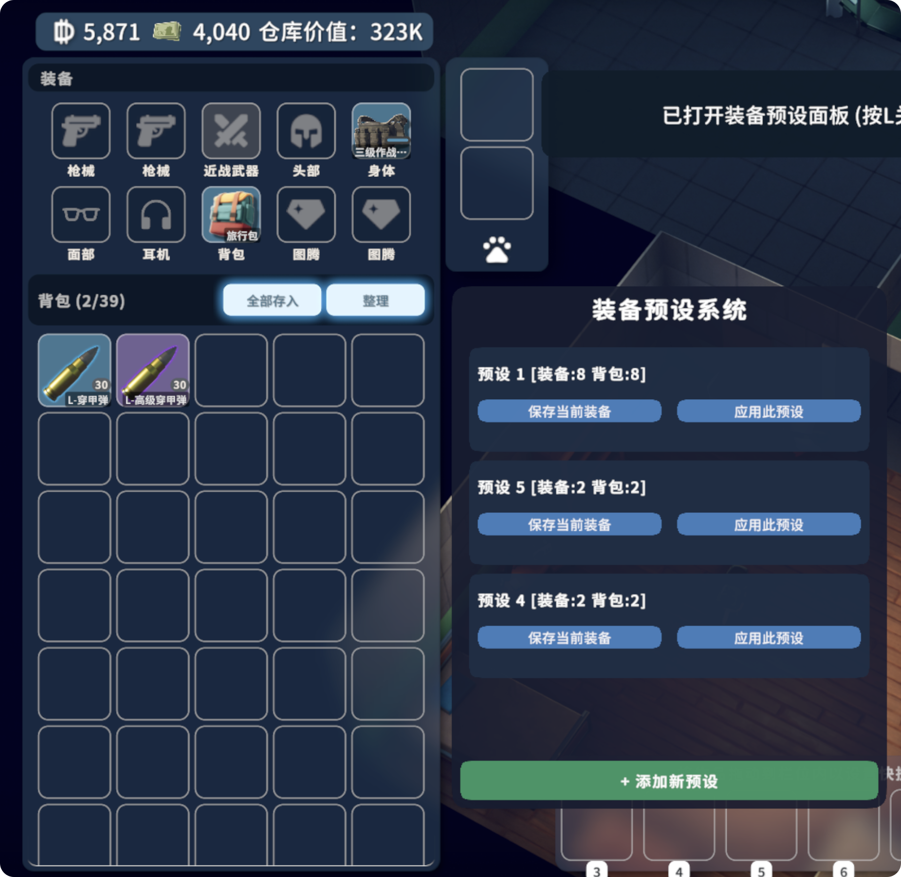

# 快速起装 | Quick Loadout

**像《三角洲行动》一样，一键快速起装！**



## ✨ 核心亮点

- 🚀 **秒速起装**: 像三角洲行动一样，按下数字键瞬间装备完毕！
- 🎯 **自定义预设**: 3 个独立预设槽位，随心配置不同战术装备组合
- 🔮 **即将推出**: 预设码分享系统 - 一键导入大佬配置！

## 功能特性

- ✅ **智能装备**: 自动从仓库获取装备并装配到正确位置
- ✅ **持久化存储**: 配置永久保存，重启游戏也不丢失
- ✅ **可视化反馈**: 清晰的游戏内提示，操作结果一目了然

## 使用方法

### 打开面板
- 按 **L** 键打开装备预设面板

### 保存预设
1. 装备好你想要保存的装备（装备槽位 + 背包）
2. 在预设面板中点击"保存当前"按钮
3. 游戏会显示"✓ 预设 X 已保存 (装备:N 背包:M)"

### 应用预设
1. 确保仓库中有足够的装备
2. 在预设面板中点击"应用此预设"按钮
3. 系统会：
   - 优先装备"装备槽位"物品
   - 然后放入"背包"物品
4. 游戏会显示成功和失败的数量

## 快捷键

| 快捷键 | 功能 |
|--------|------|
| L | 打开/关闭预设面板 |

## 安装方法

### 方法 1: 使用编译好的版本
1. 下载发布的 `PresetLoadout` 文件夹
2. 将文件夹复制到游戏目录: `<游戏安装路径>/Duckov_Data/Mods/`
3. 启动游戏，在 Mods 界面启用此 Mod

### 方法 2: 从源码编译
1. 打开 `PresetLoadout.csproj`
2. 修改 `<DuckovPath>` 为你的游戏安装路径
3. 运行快速部署脚本:
   ```bash
   ./scripts/deploy.sh
   ```
   或手动编译:
   ```bash
   dotnet build -c Release
   ```
4. 编译后的 DLL 在 `bin/Release/netstandard2.1/PresetLoadout.dll`
5. 创建发布文件夹并复制以下文件:
   ```
   PresetLoadout/
   ├── PresetLoadout.dll
   ├── info.ini
   └── preview.png
   ```

## 开发与发布

### 快速开发
```bash
./scripts/deploy.sh       # 编译并部署到游戏
./scripts/watch-log.sh    # 实时查看日志
```

### 版本发布
```bash
./scripts/release.sh             # 发布 patch 版本 (1.0.0 → 1.0.1)
./scripts/release.sh -t minor    # 发布 minor 版本 (1.0.0 → 1.1.0)
./scripts/release.sh -t major    # 发布 major 版本 (1.0.0 → 2.0.0)
```

版本号存储在 [VERSION](VERSION) 文件中，发布脚本会自动：
- 更新版本号到所有相关文件
- 编译 Release 版本
- 创建 ZIP 发布包
- 部署到 Workshop
- 创建 Git 标签和 GitHub Release

详见 [scripts/README.md](scripts/README.md)

## 技术细节

### 项目结构
```
PresetLoadout/
├── ModBehaviour.cs       # 主逻辑：UI、按键处理、预设管理
├── PresetConfig.cs       # 数据模型：PresetConfig 和 PresetStorage
├── JsonHelper.cs         # JSON 序列化工具（手动实现）
├── scripts/              # 开发脚本
│   ├── deploy.sh         # 快速编译部署
│   ├── watch-log.sh      # 实时日志监控
│   └── README.md         # 脚本文档
├── PresetLoadout.csproj  # 项目配置
└── README.md             # 本文件
```

### 数据存储
- **配置文件位置**: `~/Library/Application Support/TeamSoda/Duckov/PresetLoadout_Config.json` (macOS)
- **格式**: 手动实现的 JSON 序列化（Unity 的 JsonUtility 不支持当前数据结构）
- **数据结构**:
  - 每个预设分为两部分：
    - `EquippedItemTypeIDs` - 装备槽位的物品
    - `InventoryItemTypeIDs` - 背包中的物品

### 工作原理
1. **保存预设**:
   - 扫描玩家角色身上的所有物品
   - 通过 `IsItemInInventory()` 判断物品在装备槽位还是背包
   - 分别保存到 `EquippedItemTypeIDs` 和 `InventoryItemTypeIDs`

2. **应用预设**:
   - 优先应用装备槽位物品（使用 `SendToPlayerCharacter`）
   - 然后应用背包物品（使用 `SendToPlayerCharacterInventory`）
   - 从仓库中查找匹配物品并转移

3. **序列化**:
   - 使用 `JsonHelper` 手动构建/解析 JSON
   - 避开 Unity JsonUtility 的限制

## 注意事项

- ⚠️ 应用预设时，如果仓库中没有某个物品，该物品会被跳过
- ⚠️ 预设只保存物品的 TypeID，不保存物品的具体配置（如枪械配件）
- ⚠️ 如果角色身上装备栏已满，可能会导致部分物品无法装备

- [ ] 添加配件支持（保存枪械的配件配置）
- [ ] 添加更多预设槽位
- [ ] 添加预设重命名功能
- [ ] 添加导入/导出预设功能
- [ ] 添加自动应用预设（如：出门时自动应用）

## 许可证

本 Mod 遵循《鸭科夫社区准则》。

## 反馈与支持

如遇问题或有建议，请在 GitHub 上提 Issue。
